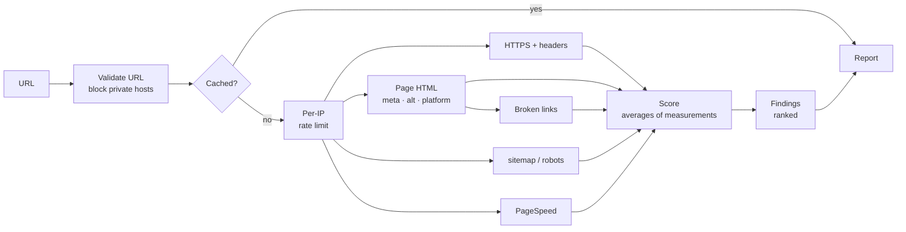

English | [Português (Brasil)](README.pt-BR.md)

# Website Scanner

Checks a website's home page for security, SEO, accessibility and performance problems, and turns the results into an explainable score and a short list of what to fix first.

### [Live demo → scan.lsdias.dev](https://scan.lsdias.dev)

Paste any public URL; no account needed.

[](https://github.com/leodds21/Website-reviewer/actions/workflows/ci.yml)
[](LICENSE)

[Architecture](docs/ARCHITECTURE.md) · [Development](docs/DEVELOPMENT.md) · [Security](SECURITY.md) · [Contributing](CONTRIBUTING.md)


I used to check prospective clients' sites by hand in several tools and translate the results for owners who aren't technical. This app runs the same checks every time, explains every point it takes off, and ends with a contact step.

## Highlights

- **Own checks plus Google's.** HTTPS, security headers, metadata, alt text, sitemap/robots.txt and broken links are implemented here; PageSpeed Insights adds Lighthouse scores and audits.
- **Concurrent checks with live progress.** Five tasks run in parallel with their own timeouts, and progress streams to the browser over Server-Sent Events.
- **Partial failure is normal.** A timeout or a firewall only affects its own category, which says why it is incomplete.
- **Explainable, deterministic scoring.** Each category is a plain average of named measurements, and the report shows what each one cost. No AI involved.
- **URLs treated as untrusted input.** Private networks blocked, every redirect rechecked, the address checked again at connection time (DNS rebinding), response size capped.

## What it checks

| Area | Own checks | Google PageSpeed Insights (mobile) |
|---|---|---|
| Security | HTTPS, `http://` redirect, certificate; HSTS, CSP, clickjacking protection | Best-practices score |
| SEO | Title, meta description, `sitemap.xml`, `robots.txt`, broken links (up to 10) | SEO score |
| Accessibility | Viewport, image alt text (up to 20 images) | Accessibility score, contrast, heading order, form labels |
| Performance | | Performance score, LCP, CLS, TTFB |
| Context | Site platform (WordPress, Wix, Squarespace, Shopify) | |

When a site blocks the scanner but not Google, Lighthouse's audits stand in for the title, description, viewport and alt-text checks.

## How it works



The page is fetched once and shared by four checks, so a scan takes about as long as its slowest check (usually PageSpeed). Each failure is classified (blocked, timeout, unreachable, quota…) and attached to the categories that depend on it. Scoring, findings and passes are pure functions over one typed result object.

## Scoring

Each category is the plain average of its 0–100 measurements: a Google score, a yes/no check (100 or 0) or a share such as working links. The overall score averages the categories that could be measured. Each measurement costs `(100 − value) ÷ N` points, rounded so the costs add up to the score. Findings are critical, attention or suggestion, and suggestions never cost points. "Fix these first" ranks by severity, then points lost. Details in [Architecture](docs/ARCHITECTURE.md#scoring-and-findings).

## Stack

Next.js 16 (App Router), React 19, TypeScript, Tailwind CSS 4, undici, Upstash Redis, Google PageSpeed Insights API, Formspree, Vitest, Playwright, GitHub Actions, Vercel.

## Technical challenges

**Fetching URLs chosen by strangers.** A scanner is an SSRF vector by design. Protocol, port and host are validated, redirects are followed manually and rechecked, and an undici dispatcher checks the resolved address at connection time. That needs undici's own `fetch`, since Node's built-in one rejects the newer dispatcher, so Node 22.19+ is required.

**Sites that refuse bots.** A 403 page parsed as HTML would invent findings like "no title". A refusal means "couldn't see it", never "missing". Partial reports say what's missing and are cached for 5 minutes instead of 6 hours.

**One score from different sources.** Google scores, yes/no checks and ratios all become 0–100 measurements in a plain average. The weights are equal, not tuned: a missing description weighs as much as Google's whole SEO score.

## Limitations

- One page per scan, not a crawl.
- HTML is read as text, not rendered; JavaScript-only content is covered only through Lighthouse.
- Sites that block bots are only partly measured.
- Google's numbers vary between runs, and the PageSpeed quota is daily.
- No database, so no scan history.

## Security and privacy

Errors reach the browser only as codes, content from analyzed sites is never rendered as HTML, and the page runs under a CSP with a per-request nonce. The analyzed URL goes to Google PageSpeed; reports are cached in Upstash for up to 6 hours and IPs for up to 1 hour; contact messages go through Formspree. No analytics; the only cookie stores the language. See [SECURITY.md](SECURITY.md) to report a vulnerability.

## Getting started

Requires Node.js 22.19+.

```bash
git clone https://github.com/leodds21/Website-reviewer.git
cd Website-reviewer
npm install
cp .env.example .env.local   # every variable is optional
npm run dev                  # http://localhost:3000
```

Tests, scripts and debugging are in [DEVELOPMENT.md](docs/DEVELOPMENT.md).

## License

[MIT](LICENSE). Built by **Leonardo Dias**: [lsdias.dev](https://www.lsdias.dev) · [GitHub](https://github.com/leodds21).
