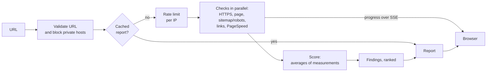

English | [Português (Brasil)](README.pt-BR.md)

# Website Scanner

Analyzes a website's home page for security, SEO, accessibility and performance, and turns the results into an explainable score and a short list of what to fix first.

**Live: [scan.lsdias.dev](https://scan.lsdias.dev)** — try it with any public URL, nothing to install.

[](https://github.com/leodds21/Website-reviewer/actions/workflows/ci.yml)
[](LICENSE)

[Architecture](docs/ARCHITECTURE.md) · [Development](docs/DEVELOPMENT.md) · [Security policy](SECURITY.md) · [Report an issue](https://github.com/leodds21/Website-reviewer/issues/new/choose)


## Why I built this

I look for clients among small businesses whose sites are slow, insecure or invisible to search engines. Checking each site meant opening several tools, reading their output and translating it into something a non-technical owner could act on. This project turns that manual routine into one report: the same checks every time, scored in a way that can be explained, and ordered by what matters most. It also ends with a contact step, so it doubles as a lead-generation tool for my own work.

## Features

**What it checks** (on the page you give it, plus a small sample of what it links to)

- HTTPS: whether the site serves it, whether `http://` redirects to it, and whether the certificate is trusted
- Security headers: HSTS, Content-Security-Policy, clickjacking protection
- SEO basics: page title, meta description, `sitemap.xml`, `robots.txt`, broken links (up to 10 links from the page)
- Accessibility basics: viewport for phones, alt text (a sample of up to 20 images)
- Platform detection: WordPress, Wix, Squarespace or Shopify, as a neutral fact
- Google PageSpeed Insights (mobile): performance, accessibility, best-practices and SEO scores, plus load time (LCP), layout shift (CLS), server response time (TTFB), color contrast, heading order and form labels

**What the report gives you**

- An overall score and four category scores, each with "Understand this score": the measurements it was averaged from and how many points each one cost
- "Fix these first": up to three findings, ranked by severity and then by how many points they cost
- Every finding with a plain-language explanation, how to fix it and the elements involved
- What the site got right, not only what's wrong
- A category that couldn't be measured says why (blocked, timed out, unreachable…) instead of showing a made-up number
- Live progress while the checks run, a shareable link for each report, print / save as PDF, Portuguese and English

## How it works



The browser calls one endpoint, `GET /api/analyze`, and reads its Server-Sent Events stream: one `step` event per finished check (what the progress bar shows), then `done` with the report. The checks run concurrently, each with its own timeout, so one slow or blocked check never holds up the rest. More in [docs/ARCHITECTURE.md](docs/ARCHITECTURE.md).

## Scoring

Scores go from 0 to 100. Each category is the plain average of the measurements behind it:

| Category | Averaged from |
|---|---|
| Performance | Google's performance score |
| SEO | Google's SEO score, title present, description present, share of working links |
| Accessibility | Google's accessibility score, viewport present, share of images with alt text |
| Security | 0 without trusted HTTPS; otherwise HTTPS (full, or half without the `http://` redirect) and Google's best-practices score |

The overall score is the plain average of the categories that could be measured. Because an average of N measurements equals 100 minus the sum of `(100 − value) ÷ N`, the report can show how many points each measurement took off, rounded to whole points that always add up to the score. Findings are graded critical, attention or suggestion; suggestions never cost points.

## Technical highlights

- **Untrusted URLs handled server-side, safely**: protocol and port allowlist, private and reserved IP ranges blocked (IPv4 and IPv6, including IPv4-mapped and NAT64 forms), every redirect re-validated, the address re-checked at connection time against DNS rebinding, response size capped.
- **Partial failure is a normal result**: each check fails on its own, a category is scored from what did run, and anything missing says why.
- **One source for score, explanation and priority**: the measurements that produce a score are kept in the report, and both "Understand this score" and "Fix these first" read from them, so they can't disagree.
- **Deterministic ranking**: severity first, then points lost, then a fixed order. No AI, no randomness.
- **Real progress**: the stream reports each check as it actually finishes.
- **Tested end to end**: unit tests for checks, scoring, ranking and the API route; Playwright tests for the whole UI flow on desktop and a 360px phone, against a mocked stream; all of it in CI.

## Technical challenges

**Fetching URLs chosen by strangers.** A scanner is an SSRF risk by design: a URL (or a redirect, or a DNS record) can point at the cloud metadata endpoint or an internal network. Validating the input URL wasn't enough, so redirects are followed manually and checked hop by hop, and target-site requests go through a connection-time DNS check, which also closes DNS rebinding.

**Sites that refuse automated clients.** Many sites answer bots with 403 or 503 pages. Parsing those as the real page would invent findings ("no title"), so refusals are treated as "we couldn't see it", not as "it's missing", and the report says the site blocked the scan. When the scanner's own fetch is refused but Google's isn't, Lighthouse's audits fill in.

**Scores that explain themselves.** The first version only stored the final number per category. Making it explainable meant computing the score from a list of named measurements and keeping that list, rather than reconstructing an explanation afterwards with a second set of rules.

## Security

- URL validation, protocol and port allowlist, private-network blocking and DNS-rebinding protection for every request to an analyzed site
- Per-IP rate limit on analyses (cached reports don't count); opening a report link never starts a new analysis
- Errors reach the browser as codes only, never as stack traces or raw messages
- Content from analyzed sites is parsed as text and never rendered as HTML
- A Content-Security-Policy with a per-request script nonce, plus HSTS, frame, content-type and referrer headers
- Secrets only in environment variables; nothing sensitive is sent to the browser

To report a vulnerability, see [SECURITY.md](SECURITY.md).

## Privacy

- **Processed**: the URL you analyze and, if you use the contact form, your name, email and message.
- **Shared with**: Google PageSpeed Insights (the URL), Upstash (the finished report and the per-IP abuse limit), Formspree (contact form data), and Vercel, which hosts the app.
- **Kept for**: reports up to 6 hours (5 minutes if a check failed); your IP up to 1 hour, only for the rate limit; contact form data isn't stored in any database of the app's own. When a check fails, the analyzed address can appear in the server logs.
- **Not used**: analytics or tracking. The only cookie stores your language.

This matches the privacy notice shown in the app.

## Getting started

Requirements: Node.js 22.19 or later, npm.

```bash
git clone https://github.com/leodds21/Website-reviewer.git
cd Website-reviewer
npm install
cp .env.example .env.local   # optional, see below
npm run dev
```

Open [http://localhost:3000](http://localhost:3000). The app runs with no environment variables at all; without a PageSpeed key, the Google-measured parts of a report show as "not measured".

### Environment variables

| Name | Needed for |
|---|---|
| `PAGESPEED_API_KEY` | Google PageSpeed Insights results |
| `NEXT_PUBLIC_FORMSPREE_ENDPOINT` | The contact form |
| `NEXT_PUBLIC_SITE_URL` | Metadata, robots.txt and sitemap URL (defaults to the production URL) |
| `UPSTASH_REDIS_REST_URL`, `UPSTASH_REDIS_REST_TOKEN` | Shared cache and rate limit (falls back to memory) |

All are optional; [.env.example](.env.example) explains each one.

### Scripts

| Command | What it does |
|---|---|
| `npm run dev` | Development server on port 3000 |
| `npm run build` / `npm start` | Production build and server |
| `npm run lint` | ESLint |
| `npm run typecheck` | Generates Next's route types, then `tsc --noEmit` |
| `npm test` | Unit and integration tests (Vitest) |
| `npm run test:e2e` | End-to-end tests (Playwright; builds and starts the app first) |

## Testing

- **Unit and integration (Vitest)**: each check against mocked network responses, the SSRF guard, scoring and its explanation, finding derivation and ranking, cache and rate limit (in memory and with a mocked Redis), and the API route with its checks mocked.
- **End-to-end (Playwright)**: the full UI flow (home, live progress, report, explanations, contact step, report links, print styles, errors), with the analysis stream mocked so tests are fast and deterministic. Runs on desktop Chrome and a 360px phone viewport.
- **CI**: every push to `master` and every pull request runs lint, typecheck, unit tests, build and the end-to-end suite.

Before the first local e2e run: `npx playwright install chromium`. Details in [docs/DEVELOPMENT.md](docs/DEVELOPMENT.md).

## Project structure

```text
.
├── app/
│   ├── api/analyze/route.ts   # the analysis endpoint (SSE)
│   ├── components/            # one component per screen and report section
│   ├── hooks/                 # analysis stream, report link, contact form
│   ├── i18n/                  # Portuguese and English, all client-side
│   └── page.tsx               # switches between home, report and contact
├── lib/
│   ├── checks/                # one file per check
│   ├── score.ts               # category and overall scores, with their measurements
│   ├── issues.ts, passes.ts   # findings and their ranking; what passed
│   ├── safeFetch.ts           # the SSRF-safe fetch every check uses
│   └── pagespeed.ts, cache.ts, rateLimit.ts, csp.ts
├── e2e/                       # Playwright tests and fixtures
├── docs/                      # architecture and development guides
└── proxy.ts                   # locale cookie and the per-request CSP nonce
```

## Trade-offs

- **One page, not a crawl.** Only the URL you give is analyzed, plus a sample of its links. Scans stay fast, cheap and predictable, at the cost of missing problems on other pages.
- **Regex over the HTML, not a browser.** The checks read the server's HTML response without running JavaScript. It's fast and safe; content added only by JavaScript is invisible to them (Google's Lighthouse, which does render, covers part of that).
- **Google's scores as single numbers.** Performance comes straight from PageSpeed; the scanner explains how much each Google score cost, but not how Google computed it.
- **No database.** Reports live only in a 6-hour cache. Nothing to manage or leak, but no history.

## Known limitations

- Sites that block automated requests can only be partly measured; the report says so.
- Results depend on the network and on the site's state at that moment; Google's numbers vary between runs.
- PageSpeed has a daily quota; when it runs out, those parts show as unavailable.
- A site without HTTPS is analyzed over plain HTTP; its security score is 0 by design.

## Roadmap

Planned, no dates:

- More checks on the same page (structured data, Open Graph tags)
- More detail on Google's performance metrics in the explanation

## Contributing

Issues and pull requests are welcome. See [CONTRIBUTING.md](CONTRIBUTING.md) and the [code of conduct](CODE_OF_CONDUCT.md).

## License

[MIT](LICENSE) © Leonardo Dias

## Author

**Leonardo Dias** — [lsdias.dev](https://www.lsdias.dev) · [GitHub](https://github.com/leodds21)

I designed and built this project: product, architecture, implementation, tests and deployment.
