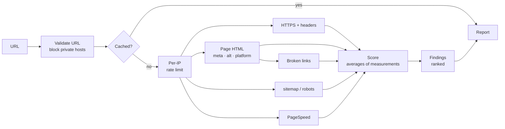

English | [Português (Brasil)](README.pt-BR.md)

# Website Scanner

Analyzes a website's home page for security, SEO, accessibility and performance problems, and turns the results into an explainable score and a short, prioritized list of what to fix first.

### [Live demo → scan.lsdias.dev](https://scan.lsdias.dev)

Paste any public URL; no account or installation needed.

[](https://github.com/leodds21/Website-reviewer/actions/workflows/ci.yml)
[](LICENSE)

[Architecture](docs/ARCHITECTURE.md) · [Development](docs/DEVELOPMENT.md) · [Security](SECURITY.md) · [Contributing](CONTRIBUTING.md)


I built it to replace a manual routine: when looking for clients among small businesses, I used to check each site in several tools and translate the results into something a non-technical owner could act on. Website Scanner runs the same checks every time, explains every point it takes off, and ends with a contact step, so it is both a real tool I use and a way for site owners to reach me.

## Technical highlights

- **Its own checks, plus Google's.** HTTPS, security headers, metadata, image alt text, sitemap/robots.txt and broken links are implemented in this codebase; Google PageSpeed Insights adds Lighthouse scores and audits on top.
- **Concurrent, independent checks.** Five tasks run in parallel, each with its own timeout; the page is fetched once and shared by four checks. Progress streams to the browser (Server-Sent Events) as each check actually finishes.
- **Partial failure is a normal outcome.** A timeout, a firewall or an external-service error affects only its own section, which is marked "partly measured" or "not measured" with the reason; everything else in the report is kept.
- **Deterministic, explainable scoring.** Each category is the plain average of named measurements, and the report keeps those measurements, so every score can show exactly which measurements cost how many points.
- **Deterministic prioritization.** "Fix these first" ranks findings by severity, then by the points they cost, then by a fixed order. No AI or randomness involved: the same input always gives the same ranking.
- **User-provided URLs handled as a security risk.** Protocol and port allowlist, private and reserved networks blocked (IPv4 and IPv6), every redirect re-validated, the resolved address checked again at connection time (DNS rebinding), response size capped.
- **Abuse limits.** Per-IP rate limit stored in Upstash Redis (one atomic transaction per request); cached reports are served for free, and a shared report link never starts a new analysis.
- **Tested in CI.** Unit and integration tests (Vitest) plus browser tests of the full UI flow on desktop and a 360px phone (Playwright), run with lint, type checks and a production build on every pull request.

## What it checks

| Area | Checked by Website Scanner itself | From Google PageSpeed Insights (mobile) |
|---|---|---|
| Security | HTTPS, whether `http://` redirects to it, certificate trust; HSTS, Content-Security-Policy, clickjacking protection | Best-practices score |
| SEO | Page title, meta description, `sitemap.xml`, `robots.txt`, broken links (up to 10 from the page) | SEO score |
| Accessibility | Viewport for phones, image alt text (sample of up to 20 images) | Accessibility score, color contrast, heading order, form labels |
| Performance | — | Performance score, load time (LCP), layout shift (CLS), server response time (TTFB) |
| Context | Site platform (WordPress, Wix, Squarespace, Shopify), as a neutral fact | — |

The scanner's own checks read the server's HTML response directly. When a site refuses that request but lets Google's Lighthouse through, Lighthouse's audits stand in for the title, description, viewport and alt-text checks. Without a PageSpeed API key, the Google column is simply reported as not measured.

## How it works



- **Concurrency.** The five tasks don't depend on each other's results (broken links reuse the page fetch), so they start together and the scan takes about as long as its slowest check, usually PageSpeed, instead of the sum of all of them. Each task emits a progress event the moment it settles.
- **Isolation.** Each task has its own timeout and its own failure. A failure is classified (blocked, timeout, unreachable, quota…) and attached to the categories that depend on it; the score is computed from whatever did run.
- **One pipeline.** Every check returns a typed result into one shared object. Scoring, findings and "what passed" are separate pure functions over that object, so adding a check means adding its file and plugging its result into those three places ([how](docs/DEVELOPMENT.md#adding-a-check)).

## Scoring and prioritization

Scores go from 0 to 100. Every category is the plain average of the measurements behind it, each one 0–100: a Google score, a yes/no check (100 or 0), or a share (such as the percentage of working links). The overall score is the plain average of the categories that could be measured.

Because an average of N measurements equals 100 minus the sum of `(100 − value) ÷ N`, the report shows how many points each measurement took off, rounded to whole points that always add up to the score. Google's scores enter as single measurements: the report says how much each one cost, not how Google computed it.

Findings are graded critical, attention or suggestion; suggestions never cost points. Each finding is linked to the measurement it explains, which is how "Fix these first" knows what a finding costs. Details in [Architecture](docs/ARCHITECTURE.md#scoring-and-findings).

## Tech stack

- **Next.js 16** (App Router, a route handler for the analysis stream, `proxy.ts` for locale and CSP), **React 19**, **TypeScript 5**
- **Tailwind CSS 4** for styling, no component library
- **undici** for fetching analyzed sites with a connection-time address check
- **Upstash Redis** (REST) for the report cache and rate limit, with an in-memory fallback
- **Google PageSpeed Insights API**; **Formspree** for the contact form
- **Vitest** and **Playwright** for tests; **GitHub Actions** for CI; deployed on **Vercel**

## Technical challenges

**Fetching URLs chosen by strangers**
- *Problem:* a scanner is an SSRF vector by design. A URL, a redirect or a DNS record can point at a cloud metadata endpoint or an internal network.
- *Decision:* validate protocol, port and host; follow redirects manually and re-check every hop; and check the address again inside the connection itself, through an undici dispatcher, which also stops DNS rebinding.
- *Trade-off:* site requests use undici's own `fetch` rather than Node's built-in one (the built-in fetch rejects the newer dispatcher), which pins a dependency and requires Node 22.19+.

**Sites that refuse automated clients**
- *Problem:* many sites answer bots with 403/503 pages. Parsing those would invent findings ("no title"), and one blocked request shouldn't sink the whole report.
- *Decision:* a refusal means "couldn't see it", never "it's missing"; each category reports why it's incomplete; Lighthouse fills in when only the scanner is blocked; HTTP-only sites are retried over `http://`.
- *Trade-off:* some reports are partial. They say so, and they are cached for 5 minutes instead of 6 hours.

**Explaining a score built from different sources**
- *Problem:* Google's 0–100 scores, yes/no checks and ratios had to become one number someone could question.
- *Decision:* turn everything into 0–100 measurements, use a plain average, and keep the measurements in the report; the explanation and the ranking read that same data instead of a second set of rules.
- *Trade-off:* equal weights are simple and transparent, not tuned. A missing description weighs as much as Google's whole SEO score within that category.

## Trade-offs and scope

- **One page, not a crawl.** Only the given URL is analyzed, plus a sample of its links. Scans stay fast, cheap and predictable; problems on other pages are out of scope.
- **Rules, not AI.** Scores and rankings come from fixed rules, so results are reproducible, explainable and free to compute.
- **HTML read as text, not rendered.** Fast and safe for untrusted content; content that only JavaScript adds is covered only through Lighthouse.
- **A 6-hour cache, no database.** Repeat scans don't spend PageSpeed quota and there's nothing to operate or leak, but there's no scan history.

## Security and privacy

Analyzing arbitrary URLs is treated as a security-sensitive operation: besides the URL protections above, errors reach the browser only as codes, content from analyzed sites is never rendered as HTML, the page runs under a Content-Security-Policy with a per-request script nonce, and secrets live only in environment variables. Vulnerabilities can be reported privately; see [SECURITY.md](SECURITY.md).

Privacy, in short: the analyzed URL goes to Google PageSpeed Insights; finished reports are cached in Upstash for up to 6 hours, and your IP is kept there for up to 1 hour for the rate limit; contact form data goes through Formspree and isn't stored in any database of the app's own; the app is hosted on Vercel, and a failed check can leave the analyzed URL in the server logs. No analytics; the only cookie stores your language. This matches the privacy notice in the app.

## Testing and CI

- **Unit and integration (Vitest):** every check against mocked network and DNS responses, the SSRF guard, score calculation and its explanation, finding derivation and ranking, partial failures, cache and rate limit, and the API route end to end with its checks mocked. Four reference sites have their exact scores pinned, so scoring can't change by accident.
- **Browser (Playwright):** the full flow (home, live progress, report and its explanations, contact step, report links, print styles, error states, security policy) on desktop Chrome and a 360px phone, against a mocked analysis stream.
- **CI:** every pull request and every push to `master` runs lint, type checks, unit tests, a production build and the browser tests ([workflow](.github/workflows/ci.yml)).

## Getting started

Requirements: Node.js 22.19 or later and npm.

```bash
git clone https://github.com/leodds21/Website-reviewer.git
cd Website-reviewer
npm install
cp .env.example .env.local   # every variable is optional
npm run dev                  # http://localhost:3000
```

The app runs without any keys; without `PAGESPEED_API_KEY`, Google's parts show as "not measured". [`.env.example`](.env.example) explains each variable, and [DEVELOPMENT.md](docs/DEVELOPMENT.md) covers scripts, tests and debugging.

## Project structure

```text
.
├── app/
│   ├── api/analyze/route.ts   # analysis endpoint: validation, cache, rate limit, checks, SSE
│   ├── components/            # one component per screen and report section
│   ├── hooks/                 # analysis stream, report link, contact form
│   ├── i18n/                  # all copy, Portuguese and English
│   └── page.tsx               # home → report → contact
├── lib/
│   ├── checks/                # one file per check
│   ├── safeFetch.ts           # SSRF-safe fetch used by every check
│   ├── score.ts               # scores and the measurements behind them
│   ├── issues.ts, passes.ts   # findings and their ranking; what passed
│   └── pagespeed.ts, cache.ts, rateLimit.ts, csp.ts
├── e2e/                       # Playwright tests and fixtures
├── docs/                      # architecture and development guides
├── .github/                   # CI workflow, issue and PR templates
└── proxy.ts                   # locale cookie and per-request CSP nonce
```

## Known limitations

- Sites that block automated requests can only be partly measured; the report says which parts and why.
- Results reflect the site and the network at that moment; Google's numbers vary between runs.
- PageSpeed has a daily quota; when it runs out, Google's parts show as unavailable.
- A site without HTTPS is analyzed over plain HTTP, and its security score is 0 by design.

## Roadmap

Planned, no dates: more checks on the same page (structured data, Open Graph tags) and more detail on Google's performance metrics in the score explanation.

## Contributing, license and author

Contributions are welcome: see [CONTRIBUTING.md](CONTRIBUTING.md) and the [code of conduct](CODE_OF_CONDUCT.md). Released under the [MIT License](LICENSE).

Designed and built by **Leonardo Dias** — [lsdias.dev](https://www.lsdias.dev) · [GitHub](https://github.com/leodds21).
