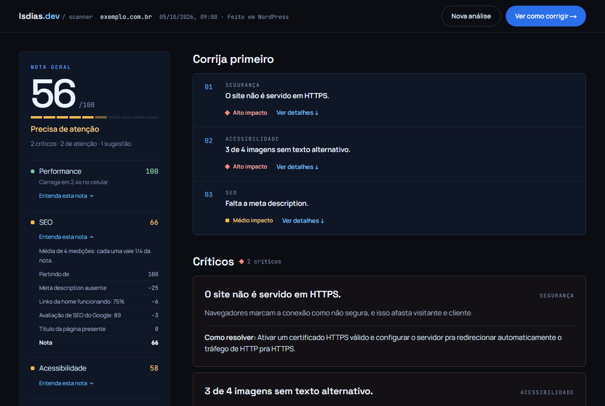
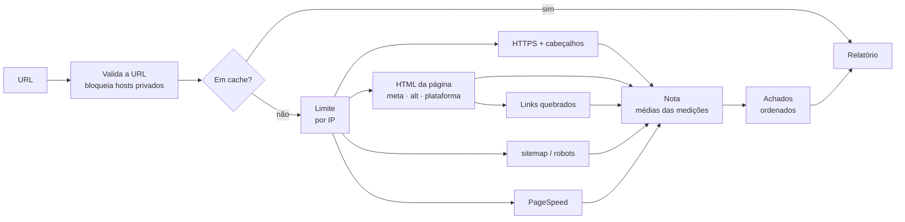

[English](README.md) | Português (Brasil)

# Website Scanner

Verifica a página inicial de um site em busca de problemas de segurança, SEO, acessibilidade e performance, e transforma o resultado numa nota explicável e numa lista curta do que corrigir primeiro.

### [Demo no ar → scan.lsdias.dev](https://scan.lsdias.dev)

Cole qualquer URL pública; sem cadastro.

[](https://github.com/leodds21/Website-reviewer/actions/workflows/ci.yml)
[](LICENSE)

[Arquitetura](docs/ARCHITECTURE.pt-BR.md) · [Desenvolvimento](docs/DEVELOPMENT.pt-BR.md) · [Segurança](SECURITY.pt-BR.md) · [Contribuindo](CONTRIBUTING.pt-BR.md)



Eu avaliava sites de possíveis clientes à mão, em várias ferramentas, e traduzia o resultado para donos de negócio sem conhecimento técnico. Este app roda as mesmas checagens toda vez, explica cada ponto que tira e termina num passo de contato.

## Destaques

- **Checagens próprias, mais as do Google.** HTTPS, cabeçalhos de segurança, metadados, texto alternativo, sitemap/robots.txt e links quebrados são implementados aqui; o PageSpeed Insights acrescenta as notas e auditorias do Lighthouse.
- **Checagens em paralelo, com progresso real.** Cinco tarefas rodam juntas, cada uma com seu tempo limite, e o progresso chega ao navegador por Server-Sent Events.
- **Falha parcial é normal.** Um tempo esgotado ou um firewall afeta só a própria categoria, que diz por que ficou incompleta.
- **Nota explicável e determinística.** Cada categoria é a média simples de medições com nome, e o relatório mostra quanto cada uma custou. Sem IA.
- **URLs tratadas como entrada não confiável.** Redes privadas bloqueadas, cada redirecionamento conferido de novo, o endereço checado outra vez na conexão (DNS rebinding), tamanho de resposta limitado.

## O que é verificado

| Área | Checagens próprias | Google PageSpeed Insights (celular) |
|---|---|---|
| Segurança | HTTPS, redirecionamento do `http://`, certificado; HSTS, CSP, proteção contra clickjacking | Nota de boas práticas |
| SEO | Título, meta description, `sitemap.xml`, `robots.txt`, links quebrados (até 10) | Nota de SEO |
| Acessibilidade | Viewport, texto alternativo (até 20 imagens) | Nota de acessibilidade, contraste, ordem dos títulos, rótulos de formulário |
| Performance | | Nota de performance, LCP, CLS, TTFB |
| Contexto | Plataforma do site (WordPress, Wix, Squarespace, Shopify) | |

Quando um site bloqueia o scanner mas não o Google, as auditorias do Lighthouse substituem as checagens de título, descrição, viewport e texto alternativo.

## Como funciona



A página é buscada uma vez e compartilhada por quatro checagens, então a análise leva mais ou menos o tempo da checagem mais lenta (em geral o PageSpeed). Cada falha é classificada (bloqueio, tempo esgotado, inacessível, cota…) e ligada às categorias que dependem dela. Nota, achados e acertos são funções puras sobre um único objeto de resultados.

## Nota

Cada categoria é a média simples das suas medições de 0 a 100: uma nota do Google, uma checagem sim/não (100 ou 0) ou uma proporção, como a de links funcionando. A nota geral é a média das categorias que puderam ser medidas. Cada medição custa `(100 − valor) ÷ N` pontos, arredondados para somar exatamente a nota. Os achados são crítico, atenção ou sugestão, e sugestões nunca tiram pontos. "Corrija primeiro" ordena por gravidade e depois por pontos perdidos. Detalhes em [Arquitetura](docs/ARCHITECTURE.pt-BR.md#nota-e-achados).

## Stack

Next.js 16 (App Router), React 19, TypeScript, Tailwind CSS 4, undici, Upstash Redis, API do Google PageSpeed Insights, Formspree, Vitest, Playwright, GitHub Actions, Vercel.

## Desafios técnicos

**Buscar URLs escolhidas por estranhos.** Um scanner é um vetor de SSRF por natureza. Protocolo, porta e host são validados, os redirecionamentos são seguidos à mão e conferidos, e um dispatcher do undici checa o endereço resolvido na hora da conexão. Isso exige o `fetch` do próprio undici, porque o do Node rejeita o dispatcher mais novo, e por isso o Node 22.19+.

**Sites que recusam robôs.** Uma página de 403 lida como HTML inventaria achados como "sem título". Recusa significa "não deu para ver", nunca "não existe". Relatórios parciais dizem o que faltou e ficam em cache por 5 minutos em vez de 6 horas.

**Uma nota a partir de fontes diferentes.** Notas do Google, checagens sim/não e proporções viram medições de 0 a 100 numa média simples. Os pesos são iguais, não calibrados: uma descrição ausente pesa o mesmo que a nota de SEO inteira do Google.

## Limitações

- Uma página por análise, sem rastrear o site.
- O HTML é lido como texto, não renderizado; conteúdo gerado só por JavaScript só entra pelo Lighthouse.
- Sites que bloqueiam robôs são medidos só em parte.
- Os números do Google variam entre execuções, e a cota do PageSpeed é diária.
- Sem banco de dados, então sem histórico de análises.

## Segurança e privacidade

Erros chegam ao navegador só como códigos, conteúdo dos sites analisados nunca é renderizado como HTML, e a página roda sob uma CSP com nonce por requisição. A URL analisada vai para o Google PageSpeed; relatórios ficam em cache no Upstash por até 6 horas e IPs por até 1 hora; mensagens de contato passam pelo Formspree. Sem analytics; o único cookie guarda o idioma. Para relatar uma vulnerabilidade, veja [SECURITY.pt-BR.md](SECURITY.pt-BR.md).

## Como rodar

Requer Node.js 22.19+.

```bash
git clone https://github.com/leodds21/Website-reviewer.git
cd Website-reviewer
npm install
cp .env.example .env.local   # todas as variáveis são opcionais
npm run dev                  # http://localhost:3000
```

Testes, scripts e depuração estão em [DEVELOPMENT.pt-BR.md](docs/DEVELOPMENT.pt-BR.md).

## Licença

[MIT](LICENSE). Feito por **Leonardo Dias**: [lsdias.dev](https://www.lsdias.dev) · [GitHub](https://github.com/leodds21).
