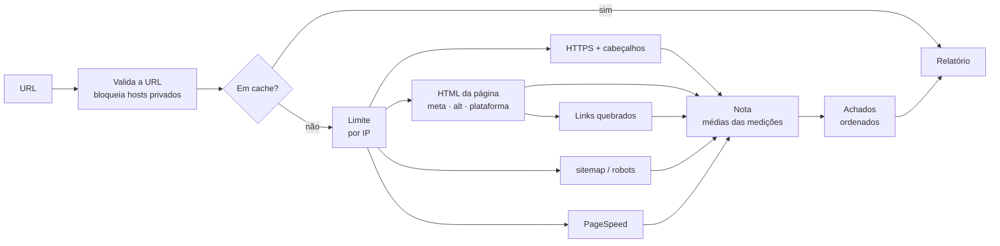

[English](README.md) | Português (Brasil)

# Website Scanner

Analisa a página inicial de um site em busca de problemas de segurança, SEO, acessibilidade e performance, e transforma o resultado numa nota explicável e numa lista curta e priorizada do que corrigir primeiro.

### [Demo no ar → scan.lsdias.dev](https://scan.lsdias.dev)

Cole qualquer URL pública; sem cadastro e sem instalar nada.

[](https://github.com/leodds21/Website-reviewer/actions/workflows/ci.yml)
[](LICENSE)

[Arquitetura](docs/ARCHITECTURE.pt-BR.md) · [Desenvolvimento](docs/DEVELOPMENT.pt-BR.md) · [Segurança](SECURITY.pt-BR.md) · [Contribuindo](CONTRIBUTING.pt-BR.md)


Eu construí para substituir uma rotina manual: ao buscar clientes entre pequenas empresas, eu avaliava cada site em várias ferramentas e traduzia o resultado em algo que um dono de negócio sem conhecimento técnico conseguisse usar. O Website Scanner roda as mesmas checagens toda vez, explica cada ponto que tira e termina num passo de contato, então é ao mesmo tempo uma ferramenta que eu uso de verdade e um jeito de donos de sites chegarem até mim.

## Destaques técnicos

- **Checagens próprias, mais as do Google.** HTTPS, cabeçalhos de segurança, metadados, texto alternativo de imagens, sitemap/robots.txt e links quebrados são implementados neste código; o Google PageSpeed Insights acrescenta as notas e auditorias do Lighthouse.
- **Checagens concorrentes e independentes.** Cinco tarefas rodam em paralelo, cada uma com seu tempo limite; a página é buscada uma vez só e compartilhada por quatro checagens. O progresso chega ao navegador (Server-Sent Events) no momento em que cada checagem de fato termina.
- **Falha parcial é um resultado normal.** Um tempo esgotado, um firewall ou um erro de serviço externo afeta só a própria seção, marcada como "medida em parte" ou "não medida" com o motivo; o resto do relatório é mantido.
- **Nota determinística e explicável.** Cada categoria é a média simples de medições com nome, e o relatório guarda essas medições, então toda nota mostra exatamente quais medições tiraram quantos pontos.
- **Priorização determinística.** "Corrija primeiro" ordena os achados por gravidade, depois pelos pontos que custam, depois por uma ordem fixa. Sem IA e sem aleatoriedade: a mesma entrada sempre dá a mesma ordem.
- **URLs informadas pelo usuário tratadas como risco de segurança.** Lista de protocolos e portas permitidos, redes privadas e reservadas bloqueadas (IPv4 e IPv6), cada redirecionamento validado de novo, o endereço resolvido conferido outra vez na hora da conexão (DNS rebinding), tamanho de resposta limitado.
- **Limites contra abuso.** Limite por IP guardado no Upstash Redis (uma transação atômica por requisição); relatórios em cache são servidos sem custo, e um link de relatório compartilhado nunca inicia uma análise nova.
- **Testado no CI.** Testes unitários e de integração (Vitest), mais testes de navegador do fluxo inteiro em desktop e num celular de 360px (Playwright), rodando com lint, checagem de tipos e build de produção em todo pull request.

## O que é verificado

| Área | Verificado pelo próprio Website Scanner | Vindo do Google PageSpeed Insights (celular) |
|---|---|---|
| Segurança | HTTPS, se o `http://` redireciona para ele, confiança do certificado; HSTS, Content-Security-Policy, proteção contra clickjacking | Nota de boas práticas |
| SEO | Título da página, meta description, `sitemap.xml`, `robots.txt`, links quebrados (até 10 da página) | Nota de SEO |
| Acessibilidade | Viewport para celular, texto alternativo de imagens (amostra de até 20) | Nota de acessibilidade, contraste de cores, ordem de títulos, rótulos de formulário |
| Performance | — | Nota de performance, tempo de carregamento (LCP), estabilidade do layout (CLS), tempo de resposta do servidor (TTFB) |
| Contexto | Plataforma do site (WordPress, Wix, Squarespace, Shopify), como informação neutra | — |

As checagens próprias leem diretamente o HTML que o servidor responde. Quando um site recusa essa requisição mas deixa o Lighthouse do Google passar, as auditorias do Lighthouse substituem as checagens de título, descrição, viewport e texto alternativo. Sem a chave da API do PageSpeed, a coluna do Google aparece simplesmente como não medida.

## Como funciona



- **Concorrência.** As cinco tarefas não dependem do resultado umas das outras (os links quebrados reaproveitam a busca da página), então começam juntas e a análise leva mais ou menos o tempo da checagem mais lenta, normalmente o PageSpeed, em vez da soma de todas. Cada tarefa emite um evento de progresso no momento em que termina.
- **Isolamento.** Cada tarefa tem seu próprio tempo limite e sua própria falha. Uma falha é classificada (bloqueado, tempo esgotado, inacessível, cota…) e ligada às categorias que dependem dela; a nota é calculada com o que rodou.
- **Um fluxo só.** Toda checagem devolve um resultado tipado num objeto compartilhado. Nota, achados e "o que passou" são funções puras separadas sobre esse objeto, então adicionar uma checagem é criar o arquivo dela e ligar o resultado nesses três lugares ([como](docs/DEVELOPMENT.pt-BR.md#adicionando-uma-checagem)).

## Nota e priorização

As notas vão de 0 a 100. Cada categoria é a média simples das medições por trás dela, cada uma de 0 a 100: uma nota do Google, uma checagem de sim/não (100 ou 0) ou uma proporção (como a porcentagem de links funcionando). A nota geral é a média simples das categorias que puderam ser medidas.

Como a média de N medições é igual a 100 menos a soma de `(100 − valor) ÷ N`, o relatório mostra quantos pontos cada medição tirou, arredondados para inteiros que sempre somam a nota. As notas do Google entram como medições únicas: o relatório diz quanto cada uma custou, não como o Google a calculou.

Os achados são classificados como crítico, atenção ou sugestão; sugestões nunca tiram pontos. Cada achado é ligado à medição que ele explica, e é assim que o "Corrija primeiro" sabe quanto um achado custa. Detalhes em [Arquitetura](docs/ARCHITECTURE.pt-BR.md#nota-e-achados).

## Stack

- **Next.js 16** (App Router, um route handler para o stream da análise, `proxy.ts` para idioma e CSP), **React 19**, **TypeScript 5**
- **Tailwind CSS 4** para o estilo, sem biblioteca de componentes
- **undici** para buscar os sites analisados com conferência do endereço na conexão
- **Upstash Redis** (REST) para o cache dos relatórios e o limite por IP, com alternativa em memória
- **API do Google PageSpeed Insights**; **Formspree** para o formulário de contato
- **Vitest** e **Playwright** para testes; **GitHub Actions** para CI; publicado na **Vercel**

## Desafios técnicos

**Buscar URLs escolhidas por desconhecidos**
- *Problema:* um scanner é um vetor de SSRF por natureza. Uma URL, um redirecionamento ou um registro de DNS pode apontar para o endpoint de metadados da nuvem ou para uma rede interna.
- *Decisão:* validar protocolo, porta e host; seguir os redirecionamentos manualmente e conferir cada salto; e conferir o endereço outra vez dentro da própria conexão, por um dispatcher do undici, o que também impede o DNS rebinding.
- *Trade-off:* as requisições aos sites usam o `fetch` do próprio undici em vez do embutido no Node (o embutido recusa o dispatcher mais novo), o que fixa uma dependência e exige Node 22.19+.

**Sites que recusam clientes automáticos**
- *Problema:* muitos sites respondem a robôs com páginas 403/503. Ler essas páginas inventaria achados ("sem título"), e uma requisição bloqueada não deveria derrubar o relatório inteiro.
- *Decisão:* uma recusa quer dizer "não conseguimos ver", nunca "está faltando"; cada categoria diz por que ficou incompleta; o Lighthouse preenche quando só o scanner é bloqueado; sites só em HTTP são tentados de novo por `http://`.
- *Trade-off:* alguns relatórios ficam parciais. Eles avisam, e ficam em cache por 5 minutos em vez de 6 horas.

**Explicar uma nota feita de fontes diferentes**
- *Problema:* notas de 0 a 100 do Google, checagens de sim/não e proporções precisavam virar um número que alguém pudesse questionar.
- *Decisão:* transformar tudo em medições de 0 a 100, usar média simples e guardar as medições no relatório; a explicação e a ordem leem esse mesmo dado, em vez de um segundo conjunto de regras.
- *Trade-off:* pesos iguais são simples e transparentes, não calibrados. Uma descrição ausente pesa tanto quanto a nota de SEO inteira do Google dentro daquela categoria.

## Trade-offs e escopo

- **Uma página, não um rastreamento.** Só a URL informada é analisada, mais uma amostra dos seus links. As análises ficam rápidas, baratas e previsíveis; problemas em outras páginas ficam fora do escopo.
- **Regras, não IA.** Notas e ordem vêm de regras fixas, então os resultados são reproduzíveis, explicáveis e sem custo para calcular.
- **HTML lido como texto, não renderizado.** Rápido e seguro para conteúdo não confiável; conteúdo que só o JavaScript adiciona entra apenas via Lighthouse.
- **Cache de 6 horas, sem banco de dados.** Análises repetidas não gastam cota do PageSpeed e não há nada para operar ou vazar, mas também não há histórico de análises.

## Segurança e privacidade

Analisar URLs arbitrárias é tratado como uma operação sensível do ponto de vista de segurança: além das proteções de URL acima, erros chegam ao navegador só como códigos, o conteúdo dos sites analisados nunca é renderizado como HTML, a página roda com uma Content-Security-Policy com nonce de script por requisição, e segredos ficam só em variáveis de ambiente. Vulnerabilidades podem ser reportadas de forma privada; veja [SECURITY.pt-BR.md](SECURITY.pt-BR.md).

Privacidade, em resumo: a URL analisada vai para o Google PageSpeed Insights; os relatórios prontos ficam em cache no Upstash por até 6 horas, e seu IP fica lá por até 1 hora para o limite de análises; os dados do formulário de contato passam pelo Formspree e não ficam em nenhum banco de dados próprio do app; o app é hospedado na Vercel, e uma checagem que falha pode deixar a URL analisada nos registros do servidor. Sem analytics; o único cookie guarda o seu idioma. Isso é o mesmo que o aviso de privacidade do app.

## Testes e CI

- **Unitários e de integração (Vitest):** cada checagem com respostas de rede e DNS simuladas, a proteção contra SSRF, o cálculo da nota e sua explicação, a criação e a ordenação dos achados, falhas parciais, cache e limite de análises, e a rota da API de ponta a ponta com as checagens simuladas. Quatro sites de referência têm as notas exatas fixadas, para a nota não mudar por acidente.
- **Navegador (Playwright):** o fluxo inteiro (início, progresso, relatório e suas explicações, contato, links de relatório, impressão, estados de erro, política de segurança) no Chrome desktop e num celular de 360px, contra um stream de análise simulado.
- **CI:** todo pull request e todo push na `master` rodam lint, checagem de tipos, testes unitários, build de produção e os testes de navegador ([workflow](.github/workflows/ci.yml)).

## Como rodar

Requisitos: Node.js 22.19 ou mais novo e npm.

```bash
git clone https://github.com/leodds21/Website-reviewer.git
cd Website-reviewer
npm install
cp .env.example .env.local   # todas as variáveis são opcionais
npm run dev                  # http://localhost:3000
```

O app roda sem nenhuma chave; sem `PAGESPEED_API_KEY`, as partes do Google aparecem como "não medido". O [`.env.example`](.env.example) explica cada variável, e o [DEVELOPMENT.pt-BR.md](docs/DEVELOPMENT.pt-BR.md) cobre scripts, testes e depuração.

## Estrutura do projeto

```text
.
├── app/
│   ├── api/analyze/route.ts   # endpoint da análise: validação, cache, limite, checagens, SSE
│   ├── components/            # um componente por tela e seção do relatório
│   ├── hooks/                 # stream da análise, link do relatório, formulário
│   ├── i18n/                  # todos os textos, português e inglês
│   └── page.tsx               # início → relatório → contato
├── lib/
│   ├── checks/                # uma checagem por arquivo
│   ├── safeFetch.ts           # fetch protegido contra SSRF usado por toda checagem
│   ├── score.ts               # notas e as medições por trás delas
│   ├── issues.ts, passes.ts   # achados e sua ordem; o que passou
│   └── pagespeed.ts, cache.ts, rateLimit.ts, csp.ts
├── e2e/                       # testes Playwright e fixtures
├── docs/                      # guias de arquitetura e desenvolvimento
├── .github/                   # workflow de CI, templates de issue e PR
└── proxy.ts                   # cookie de idioma e nonce de CSP por requisição
```

## Limitações conhecidas

- Sites que bloqueiam requisições automáticas só podem ser medidos em parte; o relatório diz quais partes e por quê.
- Os resultados refletem o site e a rede naquele momento; os números do Google variam entre execuções.
- O PageSpeed tem cota diária; quando ela acaba, as partes do Google aparecem como indisponíveis.
- Um site sem HTTPS é analisado pela versão HTTP, e a nota de segurança dele é 0 por definição.

## Próximos passos

Planejado, sem datas: mais checagens na mesma página (dados estruturados, tags Open Graph) e mais detalhe das métricas de performance do Google na explicação da nota.

## Contribuindo, licença e autor

Contribuições são bem-vindas: veja [CONTRIBUTING.pt-BR.md](CONTRIBUTING.pt-BR.md) e o [código de conduta](CODE_OF_CONDUCT.md). Publicado sob a [licença MIT](LICENSE).

Projetado e construído por **Leonardo Dias** — [lsdias.dev](https://www.lsdias.dev) · [GitHub](https://github.com/leodds21).
