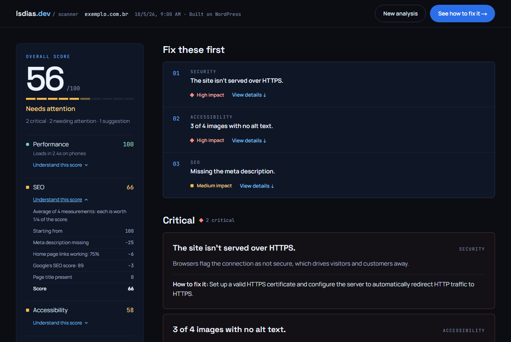
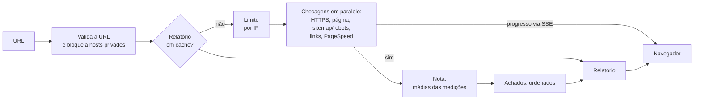

[English](README.md) | Português (Brasil)

# Website Scanner

Analisa a página inicial de um site em segurança, SEO, acessibilidade e performance, e transforma o resultado numa nota explicável e numa lista curta do que corrigir primeiro.

**No ar: [scan.lsdias.dev](https://scan.lsdias.dev)** — teste com qualquer URL pública, sem instalar nada.

[](https://github.com/leodds21/Website-reviewer/actions/workflows/ci.yml)
[](LICENSE)

[Arquitetura](docs/ARCHITECTURE.pt-BR.md) · [Desenvolvimento](docs/DEVELOPMENT.pt-BR.md) · [Política de segurança](SECURITY.pt-BR.md) · [Reportar um problema](https://github.com/leodds21/Website-reviewer/issues/new/choose)



## Por que eu construí isto

Eu busco clientes entre pequenas empresas com sites lentos, inseguros ou invisíveis para buscadores. Avaliar cada site significava abrir várias ferramentas, ler o resultado e traduzir aquilo em algo que um dono de negócio sem conhecimento técnico conseguisse usar. Este projeto transforma essa rotina manual num relatório só: as mesmas checagens toda vez, uma nota que dá para explicar e tudo ordenado pelo que mais importa. Ele termina num passo de contato, então também serve como ferramenta de geração de clientes para o meu trabalho.

## Funcionalidades

**O que é verificado** (na página informada, mais uma amostra do que ela linka)

- HTTPS: se o site serve, se o `http://` redireciona para ele e se o certificado é confiável
- Cabeçalhos de segurança: HSTS, Content-Security-Policy, proteção contra clickjacking
- SEO básico: título da página, meta description, `sitemap.xml`, `robots.txt`, links quebrados (até 10 links da página)
- Acessibilidade básica: viewport para celular, texto alternativo (amostra de até 20 imagens)
- Plataforma: WordPress, Wix, Squarespace ou Shopify, como informação neutra
- Google PageSpeed Insights (celular): notas de performance, acessibilidade, boas práticas e SEO, mais tempo de carregamento (LCP), estabilidade do layout (CLS), tempo de resposta do servidor (TTFB), contraste de cores, ordem de títulos e rótulos de formulário

**O que o relatório entrega**

- Uma nota geral e quatro notas por categoria, cada uma com "Entenda esta nota": as medições de onde ela saiu e quantos pontos cada uma tirou
- "Corrija primeiro": até três achados, ordenados por gravidade e depois por quantos pontos custam
- Cada achado com explicação em linguagem simples, como resolver e os elementos envolvidos
- O que o site faz certo, não só o que está errado
- Uma categoria que não pôde ser medida diz o motivo (bloqueado, demorou demais, inacessível…) em vez de mostrar um número inventado
- Progresso real enquanto as checagens rodam, um link compartilhável para cada relatório, imprimir / salvar PDF, português e inglês

## Como funciona



O navegador chama um endpoint, `GET /api/analyze`, e lê o stream de Server-Sent Events: um evento `step` por checagem concluída (o que a barra de progresso mostra), depois `done` com o relatório. As checagens rodam ao mesmo tempo, cada uma com seu próprio tempo limite, então uma checagem lenta ou bloqueada nunca segura as outras. Mais em [docs/ARCHITECTURE.pt-BR.md](docs/ARCHITECTURE.pt-BR.md).

## Nota

As notas vão de 0 a 100. Cada categoria é a média simples das medições por trás dela:

| Categoria | Média de |
|---|---|
| Performance | nota de performance do Google |
| SEO | nota de SEO do Google, título presente, descrição presente, proporção de links funcionando |
| Acessibilidade | nota de acessibilidade do Google, viewport presente, proporção de imagens com texto alternativo |
| Segurança | 0 sem HTTPS confiável; senão, HTTPS (completo, ou metade sem o redirecionamento do `http://`) e a nota de boas práticas do Google |

A nota geral é a média simples das categorias que puderam ser medidas. Como a média de N medições é igual a 100 menos a soma de `(100 − valor) ÷ N`, o relatório consegue mostrar quantos pontos cada medição tirou, arredondados para inteiros que sempre somam a nota. Os achados são classificados como crítico, atenção ou sugestão; sugestões nunca tiram pontos.

## Destaques técnicos

- **URLs não confiáveis tratadas com segurança no servidor**: lista de protocolos e portas permitidos, faixas de IP privadas e reservadas bloqueadas (IPv4 e IPv6, incluindo as formas IPv4-mapped e NAT64), cada redirecionamento validado de novo, o endereço conferido outra vez no momento da conexão contra DNS rebinding, tamanho de resposta limitado.
- **Falha parcial é um resultado normal**: cada checagem falha sozinha, a categoria recebe nota com o que rodou, e o que faltou diz o motivo.
- **Uma fonte só para nota, explicação e prioridade**: as medições que produzem a nota ficam no relatório, e tanto o "Entenda esta nota" quanto o "Corrija primeiro" leem delas, então não têm como discordar.
- **Ordenação determinística**: gravidade primeiro, depois pontos perdidos, depois uma ordem fixa. Sem IA, sem aleatoriedade.
- **Progresso real**: o stream informa cada checagem no momento em que ela de fato termina.
- **Testado de ponta a ponta**: testes unitários das checagens, da nota, da ordenação e da rota da API; testes Playwright do fluxo inteiro em desktop e num celular de 360px, contra um stream simulado; tudo no CI.

## Desafios técnicos

**Buscar URLs escolhidas por desconhecidos.** Um scanner é um risco de SSRF por natureza: uma URL (ou um redirecionamento, ou um registro de DNS) pode apontar para o endpoint de metadados da nuvem ou para uma rede interna. Validar a URL de entrada não bastava, então os redirecionamentos são seguidos manualmente e conferidos a cada salto, e as requisições aos sites passam por uma conferência de DNS no momento da conexão, o que também fecha o DNS rebinding.

**Sites que recusam clientes automáticos.** Muitos sites respondem a robôs com páginas 403 ou 503. Ler essas páginas como se fossem o site inventaria achados ("sem título"), então uma recusa é tratada como "não conseguimos ver", não como "está faltando", e o relatório diz que o site bloqueou a análise. Quando o acesso do scanner é recusado mas o do Google não, as auditorias do Lighthouse preenchem a lacuna.

**Notas que se explicam.** A primeira versão guardava só o número final de cada categoria. Torná-la explicável exigiu calcular a nota a partir de uma lista de medições com nome e guardar essa lista, em vez de reconstruir uma explicação depois com um segundo conjunto de regras.

## Segurança

- Validação de URL, lista de protocolos e portas permitidos, bloqueio de rede privada e proteção contra DNS rebinding em toda requisição a um site analisado
- Limite de análises por IP (relatórios em cache não contam); abrir um link de relatório nunca inicia uma análise nova
- Erros chegam ao navegador só como códigos, nunca como stack trace ou mensagem crua
- Conteúdo dos sites analisados é lido como texto e nunca renderizado como HTML
- Content-Security-Policy com nonce de script por requisição, mais cabeçalhos HSTS, de frame, de content-type e de referrer
- Segredos só em variáveis de ambiente; nada sensível é enviado ao navegador

Para reportar uma vulnerabilidade, veja [SECURITY.pt-BR.md](SECURITY.pt-BR.md).

## Privacidade

- **Processado**: a URL analisada e, se você usar o formulário de contato, seu nome, e-mail e mensagem.
- **Compartilhado com**: Google PageSpeed Insights (a URL), Upstash (o relatório pronto e o limite de abuso por IP), Formspree (dados do formulário de contato) e Vercel, que hospeda o app.
- **Guardado por**: relatórios até 6 horas (5 minutos se alguma checagem falhou); seu IP até 1 hora, só para o limite de análises; os dados do formulário não ficam em nenhum banco de dados próprio do app. Quando uma checagem falha, o endereço analisado pode aparecer nos registros do servidor.
- **Não usado**: analytics ou rastreamento. O único cookie guarda o seu idioma.

Isso é o mesmo que o aviso de privacidade exibido no app.

## Como rodar

Requisitos: Node.js 22.19 ou mais novo, npm.

```bash
git clone https://github.com/leodds21/Website-reviewer.git
cd Website-reviewer
npm install
cp .env.example .env.local   # opcional, veja abaixo
npm run dev
```

Abra [http://localhost:3000](http://localhost:3000). O app roda sem nenhuma variável de ambiente; sem a chave do PageSpeed, as partes medidas pelo Google aparecem como "não medido".

### Variáveis de ambiente

| Nome | Necessária para |
|---|---|
| `PAGESPEED_API_KEY` | Resultados do Google PageSpeed Insights |
| `NEXT_PUBLIC_FORMSPREE_ENDPOINT` | O formulário de contato |
| `NEXT_PUBLIC_SITE_URL` | URL nos metadados, robots.txt e sitemap (padrão: a URL de produção) |
| `UPSTASH_REDIS_REST_URL`, `UPSTASH_REDIS_REST_TOKEN` | Cache e limite compartilhados (sem elas, ficam em memória) |

Todas são opcionais; o [.env.example](.env.example) explica cada uma.

### Scripts

| Comando | O que faz |
|---|---|
| `npm run dev` | Servidor de desenvolvimento na porta 3000 |
| `npm run build` / `npm start` | Build e servidor de produção |
| `npm run lint` | ESLint |
| `npm run typecheck` | Gera os tipos de rota do Next e roda `tsc --noEmit` |
| `npm test` | Testes unitários e de integração (Vitest) |
| `npm run test:e2e` | Testes de ponta a ponta (Playwright; faz o build e sobe o app antes) |

## Testes

- **Unitários e de integração (Vitest)**: cada checagem com respostas de rede simuladas, a proteção contra SSRF, a nota e sua explicação, a criação e a ordenação dos achados, cache e limite de análises (em memória e com Redis simulado) e a rota da API com as checagens simuladas.
- **Ponta a ponta (Playwright)**: o fluxo inteiro da interface (início, progresso, relatório, explicações, contato, links de relatório, impressão, erros), com o stream da análise simulado para os testes serem rápidos e determinísticos. Roda no Chrome desktop e numa tela de celular de 360px.
- **CI**: todo push na `master` e todo pull request roda lint, typecheck, testes unitários, build e a suíte de ponta a ponta.

Antes de rodar o e2e localmente pela primeira vez: `npx playwright install chromium`. Detalhes em [docs/DEVELOPMENT.pt-BR.md](docs/DEVELOPMENT.pt-BR.md).

## Estrutura do projeto

```text
.
├── app/
│   ├── api/analyze/route.ts   # o endpoint da análise (SSE)
│   ├── components/            # um componente por tela e seção do relatório
│   ├── hooks/                 # stream da análise, link do relatório, formulário
│   ├── i18n/                  # português e inglês, tudo no cliente
│   └── page.tsx               # alterna entre início, relatório e contato
├── lib/
│   ├── checks/                # uma checagem por arquivo
│   ├── score.ts               # notas por categoria e geral, com as medições
│   ├── issues.ts, passes.ts   # achados e sua ordem; o que passou
│   ├── safeFetch.ts           # o fetch protegido contra SSRF que toda checagem usa
│   └── pagespeed.ts, cache.ts, rateLimit.ts, csp.ts
├── e2e/                       # testes Playwright e fixtures
├── docs/                      # guias de arquitetura e desenvolvimento
└── proxy.ts                   # cookie de idioma e o nonce de CSP por requisição
```

## Trade-offs

- **Uma página, não um rastreamento.** Só a URL informada é analisada, mais uma amostra dos seus links. As análises ficam rápidas, baratas e previsíveis, ao custo de não ver problemas em outras páginas.
- **Regex sobre o HTML, não um navegador.** As checagens leem o HTML que o servidor responde, sem rodar JavaScript. É rápido e seguro; conteúdo adicionado só por JavaScript fica invisível para elas (o Lighthouse do Google, que renderiza, cobre parte disso).
- **Notas do Google como um número só.** A performance vem direto do PageSpeed; o scanner explica quanto cada nota do Google tirou, mas não como o Google a calculou.
- **Sem banco de dados.** Os relatórios vivem só num cache de 6 horas. Nada para administrar ou vazar, mas também sem histórico.

## Limitações conhecidas

- Sites que bloqueiam requisições automáticas só podem ser medidos em parte; o relatório avisa.
- Os resultados dependem da rede e do estado do site naquele momento; os números do Google variam entre execuções.
- O PageSpeed tem cota diária; quando ela acaba, essas partes aparecem como indisponíveis.
- Um site sem HTTPS é analisado pela versão HTTP; a nota de segurança dele é 0 por definição.

## Próximos passos

Planejado, sem datas:

- Mais checagens na mesma página (dados estruturados, tags Open Graph)
- Mais detalhe das métricas de performance do Google na explicação

## Contribuindo

Issues e pull requests são bem-vindos. Veja [CONTRIBUTING.pt-BR.md](CONTRIBUTING.pt-BR.md) e o [código de conduta](CODE_OF_CONDUCT.md).

## Licença

[MIT](LICENSE) © Leonardo Dias

## Autor

**Leonardo Dias** — [lsdias.dev](https://www.lsdias.dev) · [GitHub](https://github.com/leodds21)

Eu projetei e construí este projeto: produto, arquitetura, implementação, testes e deploy.
