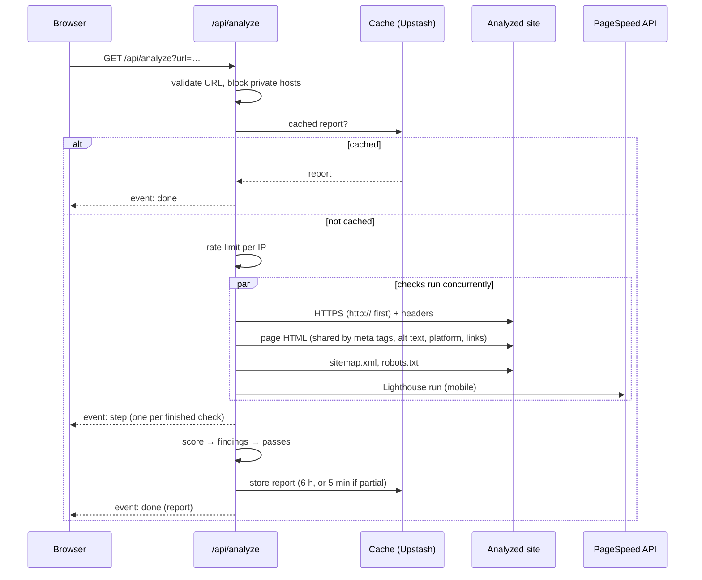

English | [Português (Brasil)](ARCHITECTURE.pt-BR.md)

# Architecture

Website Scanner is a single Next.js application (App Router, TypeScript): the page is a client component, and the analysis runs in one API route on the server. There is no database; the only persistence is a short-lived cache and a rate-limit counter.

## Modules

| Path | Responsibility |
|---|---|
| `app/page.tsx` | Switches between the home screen, the report and the contact step |
| `app/hooks/useAnalysis.ts` | Starts an analysis, reads the event stream, holds the result or the error |
| `app/hooks/useReportLink.ts` | Keeps the open report in the address bar (`?url=`) and in browser history |
| `app/components/` | One component per screen or report section (`ScanPlan`, `ScoreSummary`, `TopIssues`, `Findings`, `Passes`, …) |
| `app/i18n/translations.ts` | All copy in Portuguese and English; the server sends codes, the client words them |
| `app/api/analyze/route.ts` | Validates the URL, applies cache and rate limit, runs the checks, streams progress and the report |
| `lib/checks/` | One file per check; HTML parsers are pure functions over one shared page fetch |
| `lib/safeFetch.ts` | The only way the server fetches an analyzed site (SSRF protection) |
| `lib/pagespeed.ts` | Google PageSpeed Insights client |
| `lib/score.ts` | Category and overall scores, keeping the measurements each was averaged from |
| `lib/issues.ts`, `lib/passes.ts` | Findings derived from the results, their ranking, and what passed |
| `lib/checkFailure.ts` | Why a check failed, in terms the report can explain |
| `lib/cache.ts`, `lib/rateLimit.ts`, `lib/kv.ts` | Upstash Redis when configured, in-memory fallback otherwise |
| `proxy.ts`, `lib/csp.ts` | Locale cookie and the per-request Content-Security-Policy nonce |

## How a scan runs

1. **Validation.** The URL gets a default `https://` if it has no scheme, must be `http` or `https`, and must not point at a blocked host. Invalid input returns `400` with a code before anything else runs.
2. **Cache before rate limit.** A cached report costs nothing, so it is answered before the per-IP limit and doesn't count against it.
3. **Checks in parallel.** Five independent tasks run concurrently, each with its own timeout (8 s for the site's own checks, 3 s per link, 50 s for PageSpeed). The page is fetched once and shared by the meta-tag, alt-text, platform and broken-link checks. The HTTPS check also provides the security headers from the same response.
4. **Progress.** Each task, whether it succeeded or failed, emits its `step` events as it settles, in real completion order.
5. **HTTP-only sites.** If the HTTPS check finds no usable HTTPS, a check that failed over `https://` retries once over `http://`. A retried PageSpeed run only gets the time left before the function's limit.
6. **Report.** Results are scored, findings and passes are derived, the report is cached and sent as `done`.

## API

`GET /api/analyze?url=<address>[&cached=only]`

| Response | When |
|---|---|
| `200` `text/event-stream` | The analysis (or the cached report) |
| `400` `{ code }` | `missing-url`, `invalid-url`, `blocked-url` |
| `404` `{ code: "not-cached" }` | `cached=only` and no cached report (used when a report link is opened) |
| `429` `{ code: "rate-limited", retryAfterSeconds }` | Too many analyses from this IP; also sends `Retry-After` |

Stream events:

- `step` — `{ "step": "https" | "securityHeaders" | "metaTags" | "altImages" | "sitemapRobots" | "brokenLinks" | "pagespeed" }`
- `done` — the report (`AnalyzeReport` in `lib/report.ts`)
- `failed` — `{ "code": … }` when no check produced anything: `site-blocked`, `site-unreachable`, `timeout`, `quota-exceeded` or `analysis-failed`

The client reads the stream with `fetch` rather than `EventSource`, so it can see the HTTP status and error body of a refused request (for example, how long to wait after a rate limit).

## External services

| Service | Used for | What it receives |
|---|---|---|
| Google PageSpeed Insights | Lighthouse scores and audits | The analyzed URL |
| Upstash Redis | Report cache, per-IP rate limit | The report; the client IP (kept up to 1 hour) |
| Formspree | Contact form delivery | Name, email, message and the analyzed domain, sent from the browser |
| Vercel | Hosting | Requests; server logs include the analyzed URL when a check fails |

Without `PAGESPEED_API_KEY` the PageSpeed parts are reported as unavailable; without Upstash, cache and rate limit use an in-memory `Map` per server instance.

## Scoring and findings

**Measurements.** Each category score is the plain average of the measurements that could be taken (`lib/score.ts`):

- Performance: Google's performance score
- SEO: Google's SEO score, title present (100/0), description present (100/0), share of working links
- Accessibility: Google's accessibility score, viewport present (100/0), share of images with alt text
- Security: 0 without trusted HTTPS (and nothing else counts); otherwise the HTTPS signal (100, or 50 when `http://` doesn't redirect) averaged with Google's best-practices score

A measurement whose check didn't run is left out of the average rather than counted as 0 or 100. A category with no measurement at all is "unavailable" and carries the reason (`blocked`, `timeout`, `unreachable`, `site-error`, `quota`, `measurement-failed` or `unknown`). Category bands: below 50 critical, below 80 attention, otherwise ok. The overall score is the plain average of the measured categories.

**Explanation.** Each scored category keeps its `components`: the measurements and the whole points each took off a perfect 100 (`(100 − value) ÷ N`, rounded with the largest-remainder method so they sum to `100 − score`). The "Understand this score" panel renders exactly that list.

**Findings.** `deriveIssues` (`lib/issues.ts`) turns results into findings, each a code plus parameters (`critical`, `attention` or `suggestion`), never display text, so the report can be shown in either language without re-running anything. Suggestions never cost points. When the scanner's own page fetch was refused but Google's wasn't, Lighthouse's audits stand in for the title, description, viewport and alt-text checks.

**Priority.** `rankIssues` orders findings by severity first, then by the overall points their measurement costs (a fixed relation in `COMPONENT_ISSUES` says which measurement each finding explains), then by derivation order. "Fix these first" is the top three non-suggestion findings. The same ranking orders the findings list and the contact step's recommendations.

## Error handling

| Situation | What the user sees |
|---|---|
| Bad input | A specific message (invalid address, private address) |
| Rate limited | How long to wait |
| One check failed | The report, with the affected category "partly measured" or "not measured" and its reason |
| Every check failed | One message naming the cause (site blocked, unreachable, timeout, quota) |
| Unexpected error | A generic "couldn't finish" message; the stream closes cleanly and the error is logged server-side |
| Browser offline, stream dropped, 90 s without an answer | A specific message; the analysis can be retried |

Raw error messages, stack traces and internal details stay in the server log. The browser only ever receives codes.

## Decisions and trade-offs

- **One page, not a crawl**: fast, cheap and predictable scans; problems on other pages are out of scope.
- **Parsing HTML with regular expressions, not a DOM or headless browser**: fast and safe for untrusted input; JavaScript-rendered content is only covered through Lighthouse.
- **Refusals are not findings**: a `401/403/429/503` means "we couldn't see it", never "it's missing", so a firewall can't produce false negatives.
- **Cache 6 hours, 5 minutes for partial reports**: saves PageSpeed quota on repeated scans without locking a transient failure in for hours.
- **Scores keep their measurements**: explanation and ranking read the same data as the score instead of a second set of rules.
- **Codes from the server, words in the client**: one place for all copy, both languages, no re-analysis to switch language.
- **No database**: nothing to operate or leak; the cost is no scan history.
