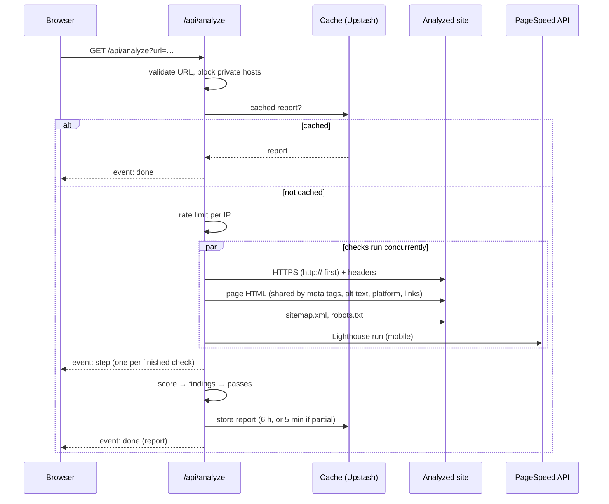

English | [Português (Brasil)](ARCHITECTURE.pt-BR.md)

# Architecture

One Next.js app (App Router, TypeScript). The page is a client component and the analysis runs in one API route. There's no database, only a short-lived cache and a rate-limit counter.

## Modules

| Path | Responsibility |
|---|---|
| `app/page.tsx` | Switches between home, report and contact step |
| `app/hooks/useAnalysis.ts` | Starts an analysis and reads the event stream |
| `app/hooks/useReportLink.ts` | Keeps the report in the address bar (`?url=`) and browser history |
| `app/components/` | One component per screen or report section |
| `app/i18n/translations.ts` | All copy, Portuguese and English |
| `app/api/analyze/route.ts` | Validation, cache, rate limit, checks, streaming |
| `lib/checks/` | One file per check; HTML parsers share one page fetch |
| `lib/safeFetch.ts` | The only way the server fetches an analyzed site (SSRF guard) |
| `lib/pagespeed.ts` | PageSpeed Insights client |
| `lib/score.ts` | Scores and the measurements behind them |
| `lib/issues.ts`, `lib/passes.ts` | Findings, their ranking, and what passed |
| `lib/checkFailure.ts` | Why a check failed, in terms the report can explain |
| `lib/cache.ts`, `lib/rateLimit.ts`, `lib/kv.ts` | Upstash Redis, with an in-memory fallback |
| `proxy.ts`, `lib/csp.ts` | Locale cookie and per-request CSP nonce |

## How a scan runs

A cached report is answered before the rate limit and doesn't count against it. Timeouts are 8 s for the site's own checks, 3 s per link and 50 s for PageSpeed. If the site has no usable HTTPS, a check that failed over `https://` retries once over `http://`.

## API

`GET /api/analyze?url=<address>[&cached=only]`

| Response | When |
|---|---|
| `200` `text/event-stream` | The analysis, or the cached report |
| `400` `{ code }` | `missing-url`, `invalid-url`, `blocked-url` |
| `404` `{ code: "not-cached" }` | `cached=only` with no cached report (report links) |
| `429` `{ code: "rate-limited", retryAfterSeconds }` | Per-IP limit reached; also sends `Retry-After` |

Events: `step` (`{ step }`, one per finished check), `done` (the `AnalyzeReport` from `lib/report.ts`) and `failed` (`{ code }`, when no check produced anything). The client reads the stream with `fetch`, not `EventSource`, so it can see error status and body.

## External services

| Service | Used for | Receives |
|---|---|---|
| Google PageSpeed Insights | Lighthouse scores and audits | The analyzed URL |
| Upstash Redis | Cache and rate limit | The report; the client IP (up to 1 hour) |
| Formspree | Contact form | Name, email, message and domain, from the browser |
| Vercel | Hosting | Requests; logs include the URL when a check fails |

## Scoring and findings

Each category is the plain average of the measurements that could be taken (`lib/score.ts`):

- Performance: Google's performance score
- SEO: Google's SEO score, title (100/0), description (100/0), share of working links
- Accessibility: Google's accessibility score, viewport (100/0), share of images with alt text
- Security: 0 without trusted HTTPS; otherwise HTTPS (100, or 50 without the `http://` redirect) averaged with Google's best-practices score

A measurement whose check didn't run is left out, not counted as 0 or 100. A category with none is "unavailable" and carries the reason. Bands: below 50 critical, below 80 attention. Each category keeps its `components`, the points each measurement took off, rounded with the largest-remainder method so they sum to `100 − score`.

`deriveIssues` turns results into findings as a code plus parameters, so the client can word them in either language. `rankIssues` orders them by severity, then by the points their measurement costs (`COMPONENT_ISSUES`), then by derivation order. "Fix these first" is the top three that aren't suggestions.

## Errors

One failed check leaves its category "partly measured" or "not measured", with the reason. If every check fails, the stream sends one `failed` code naming the cause. Raw errors and stack traces stay in the server log; the browser only gets codes.

## Decisions

- One page, not a crawl: fast and predictable scans.
- HTML read with regular expressions, not a headless browser: fast and safe for untrusted input.
- A `401/403/429/503` means "couldn't see it", never "missing".
- 6-hour cache, 5 minutes for partial reports.
- Codes from the server, words in the client.
- No database: nothing to operate or leak, and no scan history.
