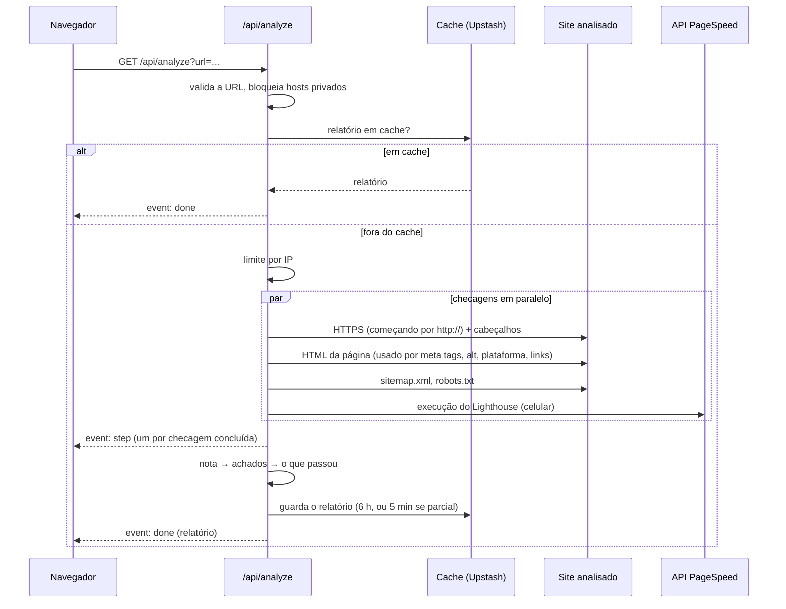

[English](ARCHITECTURE.md) | Português (Brasil)

# Arquitetura

O Website Scanner é uma aplicação Next.js única (App Router, TypeScript): a página é um componente de cliente, e a análise roda numa rota de API no servidor. Não há banco de dados; o único estado guardado é um cache de curta duração e um contador de limite de análises.

## Módulos

| Caminho | Responsabilidade |
|---|---|
| `app/page.tsx` | Alterna entre a tela inicial, o relatório e o contato |
| `app/hooks/useAnalysis.ts` | Inicia a análise, lê o stream de eventos, guarda o resultado ou o erro |
| `app/hooks/useReportLink.ts` | Mantém o relatório aberto no endereço (`?url=`) e no histórico do navegador |
| `app/components/` | Um componente por tela ou seção do relatório (`ScanPlan`, `ScoreSummary`, `TopIssues`, `Findings`, `Passes`, …) |
| `app/i18n/translations.ts` | Todos os textos em português e inglês; o servidor manda códigos, o cliente escreve as frases |
| `app/api/analyze/route.ts` | Valida a URL, aplica cache e limite, roda as checagens, transmite o progresso e o relatório |
| `lib/checks/` | Uma checagem por arquivo; os parsers de HTML são funções puras sobre uma única busca da página |
| `lib/safeFetch.ts` | O único jeito de o servidor buscar um site analisado (proteção contra SSRF) |
| `lib/pagespeed.ts` | Cliente do Google PageSpeed Insights |
| `lib/score.ts` | Notas por categoria e geral, guardando as medições de onde cada uma saiu |
| `lib/issues.ts`, `lib/passes.ts` | Achados derivados dos resultados, sua ordem, e o que passou |
| `lib/checkFailure.ts` | Por que uma checagem falhou, em termos que o relatório consegue explicar |
| `lib/cache.ts`, `lib/rateLimit.ts`, `lib/kv.ts` | Upstash Redis quando configurado; senão, memória |
| `proxy.ts`, `lib/csp.ts` | Cookie de idioma e o nonce de Content-Security-Policy por requisição |

## Como uma análise roda

1. **Validação.** A URL recebe `https://` se não tiver esquema, precisa ser `http` ou `https` e não pode apontar para um host bloqueado. Entrada inválida volta `400` com um código antes de qualquer coisa rodar.
2. **Cache antes do limite.** Um relatório em cache não custa nada, então é respondido antes do limite por IP e não conta nele.
3. **Checagens em paralelo.** Cinco tarefas independentes rodam ao mesmo tempo, cada uma com seu tempo limite (8 s para as checagens do próprio site, 3 s por link, 50 s para o PageSpeed). A página é buscada uma vez só e compartilhada pelas checagens de meta tags, texto alternativo, plataforma e links quebrados. A checagem de HTTPS também fornece os cabeçalhos de segurança da mesma resposta.
4. **Progresso.** Cada tarefa, com sucesso ou falha, emite seus eventos `step` quando termina, na ordem real de conclusão.
5. **Sites só em HTTP.** Se a checagem de HTTPS não encontra HTTPS utilizável, uma checagem que falhou por `https://` tenta de novo uma vez por `http://`. Uma nova execução do PageSpeed só recebe o tempo que sobra antes do limite da função.
6. **Relatório.** Os resultados viram nota, os achados e o que passou são derivados, o relatório vai para o cache e é enviado como `done`.

## API

`GET /api/analyze?url=<endereço>[&cached=only]`

| Resposta | Quando |
|---|---|
| `200` `text/event-stream` | A análise (ou o relatório em cache) |
| `400` `{ code }` | `missing-url`, `invalid-url`, `blocked-url` |
| `404` `{ code: "not-cached" }` | `cached=only` e nenhum relatório em cache (usado ao abrir um link de relatório) |
| `429` `{ code: "rate-limited", retryAfterSeconds }` | Análises demais deste IP; também envia `Retry-After` |

Eventos do stream:

- `step` — `{ "step": "https" | "securityHeaders" | "metaTags" | "altImages" | "sitemapRobots" | "brokenLinks" | "pagespeed" }`
- `done` — o relatório (`AnalyzeReport` em `lib/report.ts`)
- `failed` — `{ "code": … }` quando nenhuma checagem produziu nada: `site-blocked`, `site-unreachable`, `timeout`, `quota-exceeded` ou `analysis-failed`

O cliente lê o stream com `fetch`, não com `EventSource`, para conseguir ver o status HTTP e o corpo de uma requisição recusada (por exemplo, quanto tempo esperar depois de um limite).

## Serviços externos

| Serviço | Usado para | O que recebe |
|---|---|---|
| Google PageSpeed Insights | Notas e auditorias do Lighthouse | A URL analisada |
| Upstash Redis | Cache dos relatórios, limite por IP | O relatório; o IP do cliente (guardado por até 1 hora) |
| Formspree | Envio do formulário de contato | Nome, e-mail, mensagem e o domínio analisado, enviados pelo navegador |
| Vercel | Hospedagem | As requisições; os logs do servidor incluem a URL analisada quando uma checagem falha |

Sem `PAGESPEED_API_KEY`, as partes do PageSpeed aparecem como indisponíveis; sem o Upstash, cache e limite usam um `Map` em memória por instância do servidor.

## Nota e achados

**Medições.** A nota de cada categoria é a média simples das medições que puderam ser feitas (`lib/score.ts`):

- Performance: nota de performance do Google
- SEO: nota de SEO do Google, título presente (100/0), descrição presente (100/0), proporção de links funcionando
- Acessibilidade: nota de acessibilidade do Google, viewport presente (100/0), proporção de imagens com texto alternativo
- Segurança: 0 sem HTTPS confiável (e nada mais conta); senão, o sinal de HTTPS (100, ou 50 quando o `http://` não redireciona) em média com a nota de boas práticas do Google

Uma medição cuja checagem não rodou fica fora da média, em vez de contar como 0 ou 100. Uma categoria sem nenhuma medição fica "indisponível" e traz o motivo (`blocked`, `timeout`, `unreachable`, `site-error`, `quota`, `measurement-failed` ou `unknown`). Faixas: abaixo de 50 crítico, abaixo de 80 atenção, senão ok. A nota geral é a média simples das categorias medidas.

**Explicação.** Cada categoria com nota guarda seus `components`: as medições e os pontos inteiros que cada uma tirou de 100 (`(100 − valor) ÷ N`, arredondados pelo método dos maiores restos para somar `100 − nota`). O painel "Entenda esta nota" mostra exatamente essa lista.

**Achados.** `deriveIssues` (`lib/issues.ts`) transforma resultados em achados, cada um um código mais parâmetros (`crítico`, `atenção` ou `sugestão`), nunca texto pronto, então o relatório pode ser exibido em qualquer idioma sem rodar nada de novo. Sugestões nunca tiram pontos. Quando a busca da página pelo scanner é recusada mas a do Google não, as auditorias do Lighthouse substituem as checagens de título, descrição, viewport e texto alternativo.

**Prioridade.** `rankIssues` ordena os achados por gravidade primeiro, depois pelos pontos da nota geral que a medição deles custa (uma relação fixa em `COMPONENT_ISSUES` diz qual medição cada achado explica), depois pela ordem em que foram derivados. "Corrija primeiro" são os três primeiros achados que não são sugestão. A mesma ordem organiza a lista de achados e as recomendações do passo de contato.

## Tratamento de erros

| Situação | O que o usuário vê |
|---|---|
| Entrada inválida | Uma mensagem específica (endereço inválido, endereço privado) |
| Limite atingido | Quanto tempo esperar |
| Uma checagem falhou | O relatório, com a categoria afetada "medida em parte" ou "não medida" e o motivo |
| Todas as checagens falharam | Uma mensagem com a causa (site bloqueado, inacessível, demorou demais, cota) |
| Erro inesperado | Uma mensagem genérica de "não conseguimos concluir"; o stream fecha corretamente e o erro vai para o log do servidor |
| Navegador offline, stream interrompido, 90 s sem resposta | Uma mensagem específica; dá para tentar de novo |

Mensagens de erro cruas, stack traces e detalhes internos ficam no log do servidor. O navegador só recebe códigos.

## Decisões e trade-offs

- **Uma página, não um rastreamento**: análises rápidas, baratas e previsíveis; problemas em outras páginas ficam fora do escopo.
- **HTML lido com expressões regulares, não com DOM ou navegador headless**: rápido e seguro para conteúdo não confiável; conteúdo renderizado por JavaScript só entra via Lighthouse.
- **Recusa não é achado**: um `401/403/429/503` quer dizer "não conseguimos ver", nunca "está faltando", então um firewall não gera falsos negativos.
- **Cache de 6 horas, 5 minutos para relatórios parciais**: economiza cota do PageSpeed em análises repetidas sem prender uma falha passageira por horas.
- **Notas guardam suas medições**: explicação e prioridade leem o mesmo dado que a nota, em vez de um segundo conjunto de regras.
- **Códigos no servidor, frases no cliente**: um lugar só para os textos, nos dois idiomas, sem reanalisar para trocar de idioma.
- **Sem banco de dados**: nada para operar ou vazar; o custo é não ter histórico de análises.
