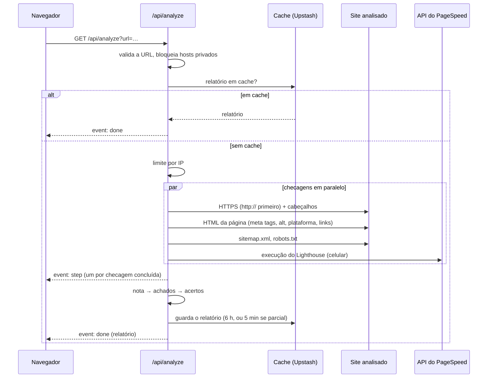

[English](ARCHITECTURE.md) | Português (Brasil)

# Arquitetura

Um único app Next.js (App Router, TypeScript). A página é um componente cliente e a análise roda numa rota de API. Não há banco de dados, só um cache de curta duração e um contador de limite de uso.

## Módulos

| Caminho | Responsabilidade |
|---|---|
| `app/page.tsx` | Alterna entre início, relatório e passo de contato |
| `app/hooks/useAnalysis.ts` | Inicia uma análise e lê o stream de eventos |
| `app/hooks/useReportLink.ts` | Mantém o relatório no endereço (`?url=`) e no histórico |
| `app/components/` | Um componente por tela ou seção do relatório |
| `app/i18n/translations.ts` | Todos os textos, em português e inglês |
| `app/api/analyze/route.ts` | Validação, cache, limite, checagens, streaming |
| `lib/checks/` | Um arquivo por checagem; os parsers de HTML dividem uma busca da página |
| `lib/safeFetch.ts` | O único jeito de o servidor buscar um site analisado (proteção SSRF) |
| `lib/pagespeed.ts` | Cliente do PageSpeed Insights |
| `lib/score.ts` | Notas e as medições por trás delas |
| `lib/issues.ts`, `lib/passes.ts` | Achados, a ordem deles, e o que está certo |
| `lib/checkFailure.ts` | Por que uma checagem falhou, em termos que o relatório explica |
| `lib/cache.ts`, `lib/rateLimit.ts`, `lib/kv.ts` | Upstash Redis, com alternativa em memória |
| `proxy.ts`, `lib/csp.ts` | Cookie de idioma e nonce da CSP por requisição |

## Como uma análise roda

Um relatório em cache é respondido antes do limite por IP e não conta para ele. Os tempos limite são 8 s para as checagens próprias, 3 s por link e 50 s para o PageSpeed. Se o site não tem HTTPS utilizável, uma checagem que falhou pelo `https://` tenta de novo uma vez pelo `http://`.

## API

`GET /api/analyze?url=<endereço>[&cached=only]`

| Resposta | Quando |
|---|---|
| `200` `text/event-stream` | A análise, ou o relatório em cache |
| `400` `{ code }` | `missing-url`, `invalid-url`, `blocked-url` |
| `404` `{ code: "not-cached" }` | `cached=only` sem relatório em cache (links de relatório) |
| `429` `{ code: "rate-limited", retryAfterSeconds }` | Limite por IP atingido; também envia `Retry-After` |

Eventos: `step` (`{ step }`, um por checagem concluída), `done` (o `AnalyzeReport` de `lib/report.ts`) e `failed` (`{ code }`, quando nenhuma checagem produziu nada). O cliente lê o stream com `fetch`, não `EventSource`, para ver o status e o corpo dos erros.

## Serviços externos

| Serviço | Para quê | Recebe |
|---|---|---|
| Google PageSpeed Insights | Notas e auditorias do Lighthouse | A URL analisada |
| Upstash Redis | Cache e limite de uso | O relatório; o IP (por até 1 hora) |
| Formspree | Formulário de contato | Nome, e-mail, mensagem e domínio, enviados pelo navegador |
| Vercel | Hospedagem | Requisições; os logs incluem a URL quando uma checagem falha |

## Nota e achados

Cada categoria é a média simples das medições que puderam ser feitas (`lib/score.ts`):

- Performance: nota de performance do Google
- SEO: nota de SEO do Google, título (100/0), descrição (100/0), proporção de links funcionando
- Acessibilidade: nota de acessibilidade do Google, viewport (100/0), proporção de imagens com texto alternativo
- Segurança: 0 sem HTTPS confiável; senão, HTTPS (100, ou 50 sem o redirecionamento do `http://`) em média com a nota de boas práticas do Google

Uma medição cuja checagem não rodou fica fora da média, em vez de contar como 0 ou 100. Uma categoria sem nenhuma fica "indisponível" e traz o motivo. Faixas: abaixo de 50 crítico, abaixo de 80 atenção. Cada categoria guarda seus `components`, os pontos que cada medição tirou, arredondados pelo método dos maiores restos para somar `100 − nota`.

`deriveIssues` transforma os resultados em achados como código mais parâmetros, para o cliente escrever em qualquer idioma. `rankIssues` ordena por gravidade, depois pelos pontos que a medição custa (`COMPONENT_ISSUES`), depois pela ordem de derivação. "Corrija primeiro" são os três primeiros que não são sugestão.

## Erros

Uma checagem que falha deixa a categoria "medida em parte" ou "não medida", com o motivo. Se todas falham, o stream envia um código `failed` com a causa. Erros crus e stack traces ficam no log do servidor; o navegador só recebe códigos.

## Decisões

- Uma página, não um rastreamento: análises rápidas e previsíveis.
- HTML lido com expressões regulares, não com navegador headless: rápido e seguro para conteúdo não confiável.
- Um `401/403/429/503` quer dizer "não deu para ver", nunca "não existe".
- Cache de 6 horas, 5 minutos para relatórios parciais.
- Códigos no servidor, frases no cliente.
- Sem banco de dados: nada para operar ou vazar, e sem histórico de análises.
